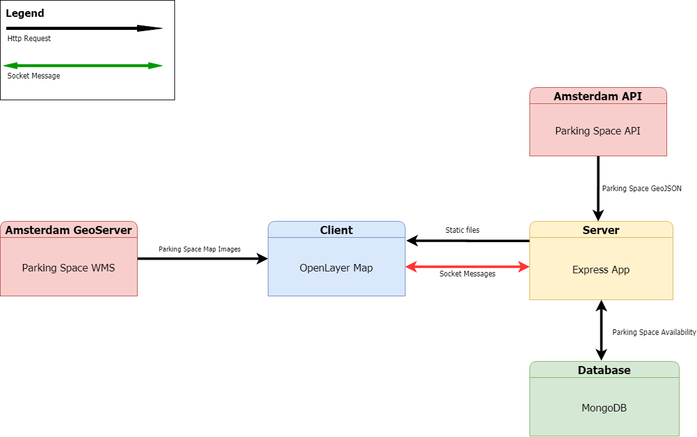

# Real-Time Web @cmda-minor-web · 2019-2020

This is a basic chat-app made with Socket.io & Express that recognizes web links and embeds Youtube videos to the chat.

## Installation
Clone this repo with your favourite GIT CLI or GUI.  
CD to the root of the project folder.  
Run ` npm install ` to install this project and its necessary dependencies.  

## Usage
Run `npm dev` and go to `localhost:3002` to see the dev version running with nodemon.  
Run `npm start` and go to `localhost:3002` to see the dev version running.

## Live Version
Here is a link to the live version on Heroku: https://live-tangle.herokuapp.com/

## Data Flow Diagram

## Message Types
- `chat message` a normal chat message that could contain a link to a website or not.
- `video` Sends an embedded Youtube Video to the chat
