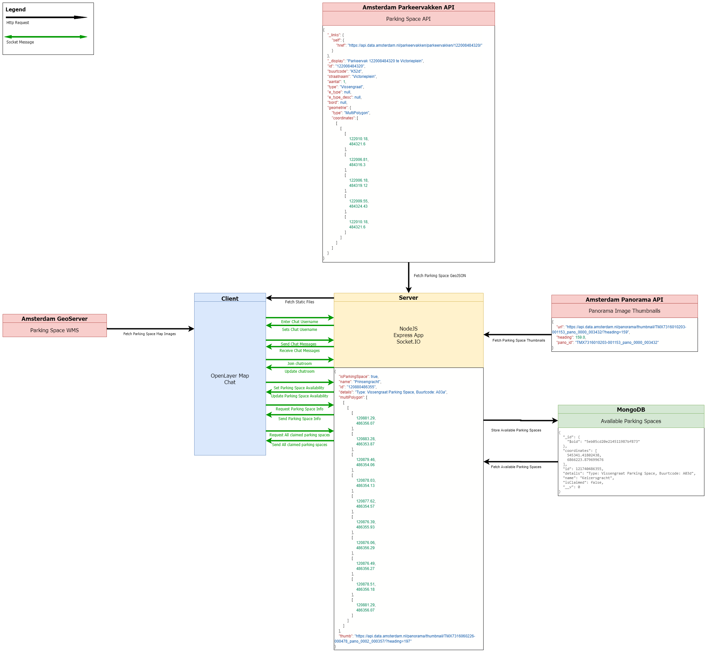

# A Collaborative Parking Space Manager

This is an web app where you can manage the available parking spaces within the municipality of Amsterdam with other parking space users.

[](https://travis-ci.com/tnanhekhan/real-time-web-1920)
[](https://live-tangle.herokuapp.com)


## Table of Contents
- [Installation](#installation)
- [Usage](#usage)
- [Live Version](#live-version)
- [Data Lifecycle](#data-lifecycle)
- [API](#api)
- [Extras](#extras)
- [Project Wishlist](#project-wishlist)
- [Built With](#built-with)
- [License](#license)

## Installation
Clone this repo with your favourite GIT CLI or GUI.  
CD to the root of the project folder.  
Run ` npm install ` to install this project and its necessary dependencies.  

## Usage
Run `npm dev` and go to `localhost:3002` to see the dev version running with nodemon.  
Run `npm start` and go to `localhost:3002` to see the dev version running.

## Live Version
Here is a link to the live version on Heroku: https://live-tangle.herokuapp.com/

## Data Lifecycle


### Socket Events
- `set username` sets a username for the chat
- `chat message` a normal chat message with linkable parking spaces
- `media` chat message with embedded media
- `joined room` chat welcome message whenever someone joins a room
- `change room` changes the chatroom of the user
- `fetch parkingSpaceInfo` fetches parking space info through the server from the Amsterdam Api
- `fetch claimedParkingSpaces` fetches the claimed parking spaces through the server from the database
- `claim` Sets a parking space to unavailable
- `unclaim` Sets a parking space back to available

### Data
Here's an example of data the server sends with the `fetch parkingSpaceInfo` socket event:
```json5
{
  isParkingSpace: true,
  name: 'Kerkstraat',
  id: '121803486246',
  details: 'Type: Langs Parking Space, Buurtcode: A03d',
  multiPolygon: [],
  thumb: 'https://api.data.amsterdam.nl/panorama/thumbnail/TMX7316010203-001176_pano_0000_001717/?heading=119'
}
```

## API
The API of the municipality of Amsterdam is Public Access and does not need a key.

The municipality has an API for Parking Space GeoData based on Latitude and Longitude: https://api.data.amsterdam.nl/parkeervakken/geosearch/

The municipality has an API for panorama images of parking spaces: https://api.data.amsterdam.nl/panorama/

For the data on the map, the municipality of Amsterdam has WMS available based on OGC: https://api.data.amsterdam.nl/api/

## Extras
I've been able to connect a MongoDB database to the app so I can persist the available parking spaces to the Database and fetch them for all new users.
The MongoDB database is hosted on MongoDB Atlas. I used [Mongoose](https://mongoosejs.com/) to streamline the MongoDB api within Node.JS.

## Project Wishlist
- [x] Going from a parking space in the list to the location on a map
- [x] Multiple chatrooms per city district
- [x] Image of the parking space inside the parking space info box
- [ ] Linking Parking Spaces in Chat
- [ ] Mobile Friendly

## Built with
Server:
- [Node.js](https://nodejs.org/en/): A JavaScript runtime built on Chrome's V8 JavaScript engine.
- [Express.js](https://expressjs.com/): A minimal and flexible Node.js web application framework.
- [EJS](https://ejs.co/): Embedded JavaScript templating.
- [Axios](https://github.com/axios/axios): Promise based HTTP client for the browser and node.js
- [Nodemon](https://nodemon.io/): An utility that will monitor for any changes in your source and automatically restart your server.
- [Socket.IO](https://socket.io/): A library that enables real-time, bidirectional and event-based communication between the browser and the server
- [Mongoose](https://mongoosejs.com/): Elegant mongodb object modeling for Node.js
- [Noembed](https://noembed.com/): An endpoint for embeddable content

Client: 
- [Bulma](https://bulma.io/): A free, open source CSS framework based on Flexbox
- [OpenLayers](https://openlayers.org/): An open-source JavaScript library for displaying map data in web browsers as slippy maps.
- [Ol-geocoder](https://github.com/jonataswalker/ol-geocoder): A geocoder extension for OpenLayers. 

Database:
- [MongoDB](https://www.mongodb.com/): A general purpose, document-based, distributed database built for modern application developers and for the cloud era.
- [MongoDB Atlas](https://www.mongodb.com/cloud/atlas): MongoDB cloud-based database hosting.

## License
[MIT](https://choosealicense.com/licenses/mit/)
